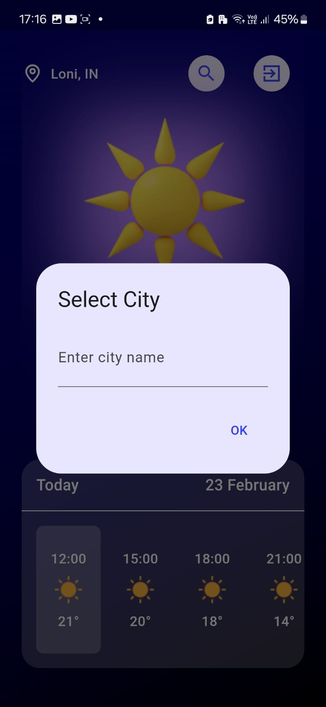

# Flutter Weather App with Firebase Auth
This Flutter app displays current weather based on device location or by searching for a city. Firebase Auth is integrated for secure user authentication.

## Features
1. Weather Info: View current weather for device location.
2. City Search: Search and view weather for any city.
3. Firebase Auth: Secure user login using Firebase Authentication.


## ScreenShots
1. Splash Screen
  

2. Login Screen
  

3. Registeration Screen
  

4. Home Screen
  

5. Search Screen


## Prerequisites 🛠

Before running the app, make sure you have the following:

- Flutter SDK: [Install Flutter](https://flutter.dev/docs/get-started/install)
- Firebase Project: [Create a Firebase project](https://console.firebase.google.com/) and set up Firestore database.

## Getting Started 🚀

1. **Clone the repository:**

   ```bash
   git clone https://github.com/yashCodesDev/weather.git


## Contributing 🤝
We welcome contributions to improve the Weather Flutter App! 🙌 Feel free to submit issues, pull requests, or suggest new features.
